# SinalizaAção: Animais em Voga — WebApp de Realidade Aumentada

WebApp de **Realidade Aumentada (AR)** feito para celulares Android e iPhone (e
funcional em tablets e computadores):

- **📖 Livro em AR** — aponte o celular para uma página do livro e o animal aparece
  em 3D sobre ela, acompanhado do **vídeo do sinal em LIBRAS** (com o fundo verde
  removido em tempo real). O botão **✋ Interagir** tira o animal da página para
  girar, aproximar e explorar com os dedos.
- **🎮 Sala de Jogos**, com:
  - **🃏 Jogo de Cartas** — o jogo sorteia uma carta (como um baralho, sem repetir
    no ciclo), a criança procura a carta física e a escaneia: acerto soma pontos e
    bônus de tempo, erro desconta pontos, **⏭️ Pular** passa a vez.
  - **🐾 Bichinho Virtual** — a criança cuida dos 5 animais do livro (fome, sede,
    higiene, diversão, sono e saúde). As **cartas de LIBRAS são mágicas**: cada
    carta reconhecida pela câmera faz uma ação no jogo (dar mel, dar banho, curar...).
    Os bichinhos continuam vivendo com o app fechado e o progresso fica salvo no aparelho.
  - **✋ Sinalize e Conte** — o jogo sorteia uma vogal; a criança escaneia a carta
    da vogal em LIBRAS e **faz o sinal com a própria mão** na frente da câmera (o
    [MediaPipe](https://ai.google.dev/edge/mediapipe/solutions/vision/hand_landmarker)
    confere o sinal). Aí aparecem **1, 2 ou 3 animais em 3D** para contar. Quanto mais
    rápido e preciso, mais pontos; 5 rodadas por partida e recordes salvos no aparelho.

Tudo roda no navegador, sem instalar nada: [MindAR](https://github.com/hiukim/mind-ar-js)
(reconhecimento de imagens) + [Three.js](https://threejs.org/) (3D) +
[MediaPipe](https://ai.google.dev/edge/mediapipe) (mãos, no Sinalize e Conte) + HTML/CSS/JS.

| Menu | Livro em AR (animal 3D + LIBRAS) | Modo Interação | Jogo de Cartas |
|---|---|---|---|
| 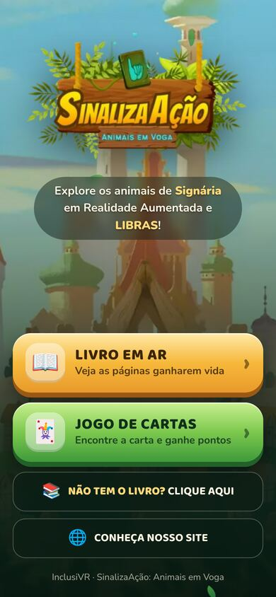 | 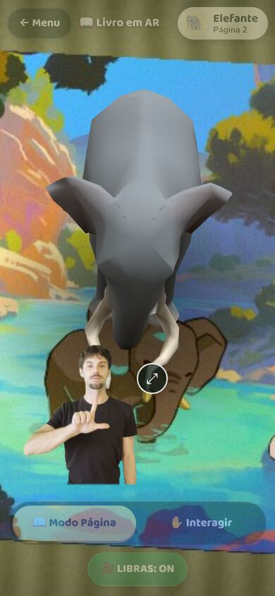 | 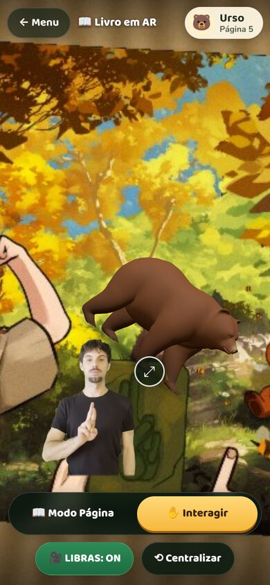 | 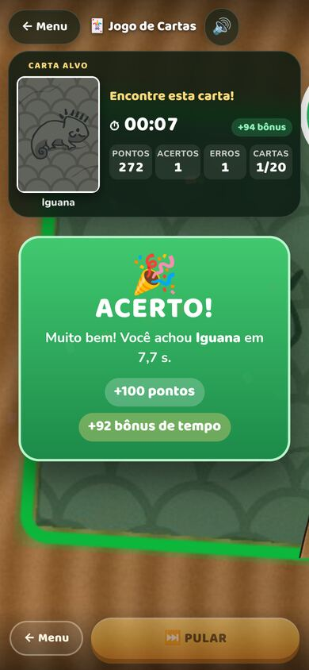 |

| Sala de Jogos | Bichinho: como jogar | Quarto do bichinho | Carta mágica em AR |
|---|---|---|---|
| 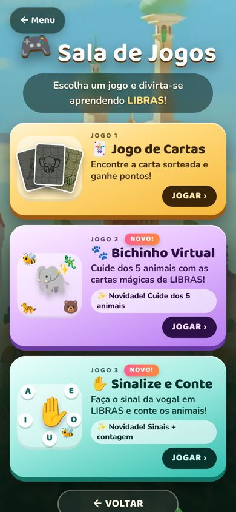 | 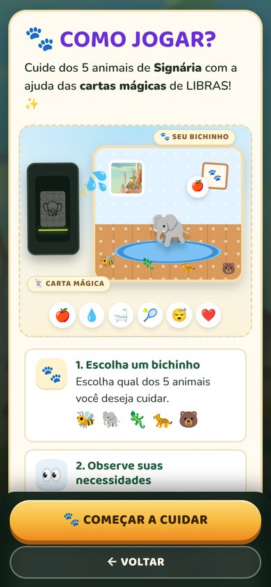 | 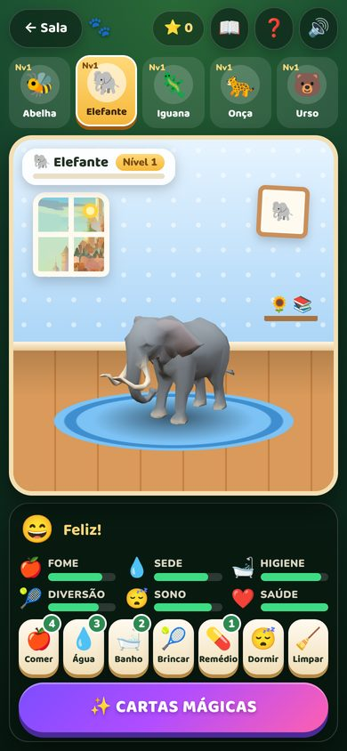 | 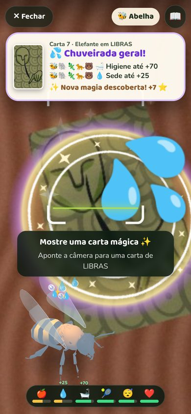 |

| Sinalize e Conte: como jogar | Faça o sinal (MediaPipe) | Conte os animais | Resultado e recordes |
|---|---|---|---|
| 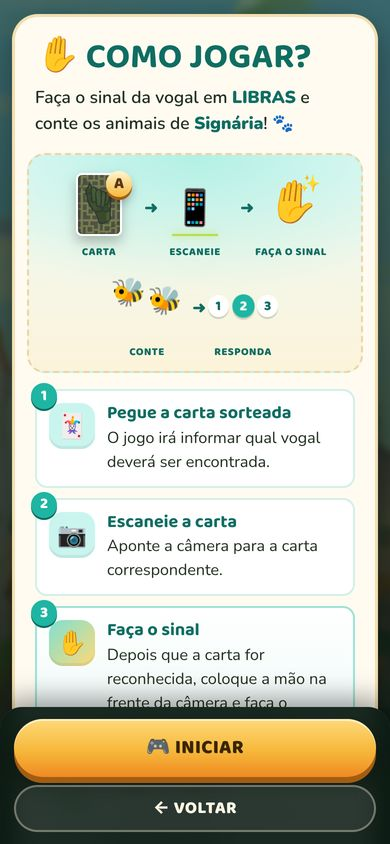 | 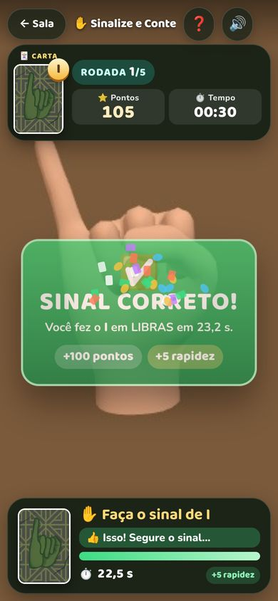 | 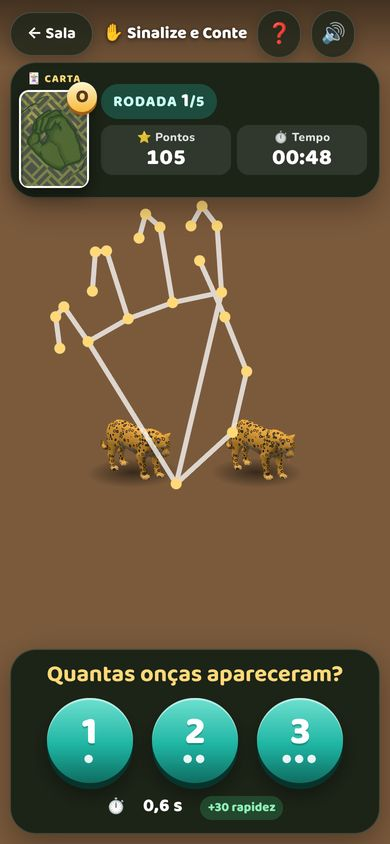 | 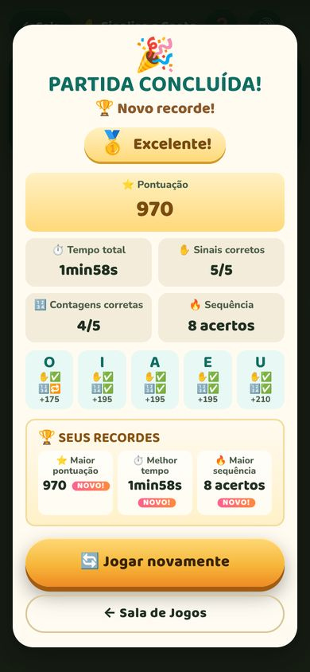 |

---

## 1. Como abrir

**Publicado (recomendado):** a câmera só funciona em endereços `https://`. Com o
GitHub Pages ativado (seção 11), o app fica em
`https://<usuário>.github.io/inclusiappar/` — a raiz redireciona para `inclusiapp/`.

**No computador, para desenvolver:**

```bash
npm install          # só para as ferramentas e testes (Playwright)
npm start            # http://localhost:8080/inclusiapp/
```

No próprio computador, `localhost` é considerado seguro e a webcam funciona. Para
testar num celular, use o endereço publicado (HTTPS).

## 2. Estrutura

```text
/
├── index.html                  redireciona para inclusiapp/
├── inclusiapp/                 ← o WebApp (pasta publicada)
│   ├── index.html              telas: carregamento, menu, explicações, AR
│   ├── manifest.webmanifest    instalação como app (PWA)
│   ├── sw.js                   service worker (cache para visitas seguintes)
│   ├── src/
│   │   ├── main.js             inicialização, rotas, pré-carregamento
│   │   ├── router.js           navegação (#/, #/livro, #/sala, #/jogo, #/bichinho, #/sinalize ...)
│   │   ├── config.js           ★ CONFIGURAÇÃO CENTRAL
│   │   ├── lib/three.js        ponto único de importação do Three.js
│   │   ├── ar/
│   │   │   ├── arSession.js    câmera + MindAR + Three.js (ciclo de vida, erros, projeção)
│   │   │   ├── targets.js      carrega os .mind (comprimidos, com verificação)
│   │   │   ├── bookAR.js       experiência do livro (Modo Página / Interação)
│   │   │   ├── modelManager.js modelos 3D sob demanda, sombra, animação
│   │   │   ├── animalMaterial.js cores, padrões e partes animadas (shaders)
│   │   │   ├── gestures.js     girar, pinça, torcer, arrastar, duplo toque
│   │   │   └── videoChroma.js  vídeo de LIBRAS com chroma key (WebGL)
│   │   ├── game/
│   │   │   ├── cardGame.js     experiência do jogo (interface + AR)
│   │   │   ├── gameState.js    regras (acerto, erro, pular, ciclo) — sem DOM
│   │   │   ├── deck.js         baralho em ciclos (Fisher–Yates)
│   │   │   ├── scoring.js      pontos, penalidade, bônus de tempo
│   │   │   └── timer.js        cronômetro
│   │   ├── pet/                🐾 BICHINHO VIRTUAL (seção 9)
│   │   │   ├── petConfig.js    ★ configuração: necessidades, itens, ações e MAGIA DE CADA CARTA
│   │   │   ├── petState.js     dados, passagem do tempo, doenças, salvamento — sem DOM
│   │   │   ├── petActions.js   cuidados (comer, beber, banho...) — sem DOM
│   │   │   ├── cardMagic.js    cartas mágicas: tipos de efeito e execução — sem DOM
│   │   │   ├── petRoom.js      quarto 3D (modelos do livro, reações, cores)
│   │   │   ├── petMagicAR.js   câmera das cartas mágicas (ARSession + efeitos sobre a carta)
│   │   │   ├── petGame.js      tela do jogo (interface)
│   │   │   ├── petIntro.js     tela "Como jogar?"
│   │   │   └── petSound.js     sons sintetizados
│   │   ├── sign/               ✋ SINALIZE E CONTE (seção 10)
│   │   │   ├── signConfig.js   ★ configuração: vogal → carta → animal, pontuação, tempos, reconhecimento
│   │   │   ├── signState.js    partida: rodadas, baralho, Tempo 1 e Tempo 2, pontos — sem DOM
│   │   │   ├── signScore.js    pontos por rapidez e classificação final — sem DOM
│   │   │   ├── signRecords.js  recordes salvos no aparelho — sem DOM
│   │   │   ├── handSigns.js    reconhece A, E, I, O, U pelos 21 pontos da mão — sem DOM
│   │   │   ├── signJudge.js    decide ao longo de vários quadros (certo / incorreto) — sem DOM
│   │   │   ├── handTracker.js  MediaPipe Hand Landmarker (carregado sob demanda)
│   │   │   ├── signAnimals.js  1, 2 ou 3 animais em 3D na frente da câmera
│   │   │   ├── signGame.js     tela do jogo (carta → sinal → animais → contagem → resultado)
│   │   │   └── signIntro.js    tela "✋ COMO JOGAR?"
│   │   ├── ui/                 menu, Sala de Jogos, explicações, avisos/erros, sons, efeitos
│   │   └── styles/             main.css (identidade visual), sala.css, pet.css, sign.css
│   ├── assets/                 arquivos GERADOS a partir dos originais
│   │   ├── models/*.glb        animais convertidos (tools/convert_models.py)
│   │   ├── targets/            paginas.mind, cartas.mind (+ .gz, .json)
│   │   ├── img/                imagens otimizadas (WebP), ícones e cartas-mini/ (miniaturas)
│   │   └── fonts/              Baloo 2 e Nunito (OFL)
│   ├── vendor/                 MindAR 1.2.5, Three.js r160 e MediaPipe Tasks Vision 1.0.1 (cópias locais)
│   ├── cartas/ codes/ exemplo/ modelo3d/ pag/ videos/   ← arquivos originais
├── tools/                      conversores, compilador de alvos, servidor, visualizador
├── tests/                      testes unitários, de reconhecimento e ponta a ponta
└── docs/screenshots/
```

Os arquivos originais ficam intactos; o app usa os originais quando eles já são
adequados à Web (cartas, vídeos) e versões geradas quando não são (modelos,
imagens decorativas, alvos do MindAR).

## 3. O que foi encontrado nos arquivos

| Pasta | Conteúdo real | Uso no app |
|---|---|---|
| `cartas/` | **20** cartas PNG (≈460×700). Grupos: 1–5 animais, 6–10 sinais dos animais em LIBRAS, 11–15 vogais no alfabeto manual, 16–20 letras A E I O U | alvos do jogo (`cartas.mind`) e imagem da carta-alvo |
| `pag/` | 5 páginas PNG (935×1319 a 1332×908) | alvos do livro (`paginas.mind`) |
| `modelo3d/` | **não são FBX**: são assets `Mesh` do Unity em YAML (classe 43), com malha e rig (pesos de skinning), **sem texturas, materiais nem animações** | convertidos para GLB (seção 5) |
| `videos/` | MP4 H.264 940×742, 30 fps, 10–18 s, **sem áudio**, fundo **verde-limão** (não verde de estúdio) | LIBRAS com chroma key (seção 7) |
| `exemplo/` | `vila.jpg` (4961×3508, 13,8 MB) — a cidade de **Signária**; `logo.png`; `protagonista.png` — a **Aia** | fundo do app (WebP de 75 KB), logotipo, Aia no menu e no jogo |
| `codes/` | `ARCombinationGameManager.cs` (a classe interna se chama `ARStoryGameManager`) | lógica adaptada no jogo (seção 8) |

> Observação: no Unity, o nome da classe deve ser igual ao do arquivo; com
> `ARStoryGameManager` dentro de `ARCombinationGameManager.cs`, o Unity não
> consegue anexar o script a um objeto.

## 4. Configuração central — `inclusiapp/src/config.js`

Toda a relação **Página → Alvo → Animal → Modelo → Vídeo** está em `ANIMALS`:

```js
{ id: 'abelha', page: 1, target: 0, image: 'pag/Pagina1.png', name: 'Abelha', emoji: '🐝',
  model: 'assets/models/abelha.glb', video: 'videos/abelha.mp4', scale: 0.4, lift: 0.12, offset: [0, 0.05] }
```

`target` é o índice no `paginas.mind`, que segue a numeração dos arquivos:
`Pagina1 → 0, Pagina2 → 1, Pagina3 → 2, Pagina4 → 3, Pagina5 → 4`.
No mesmo arquivo: links do menu (`APP.links`), parâmetros do chroma key
(`LIBRAS`), nomes das cartas e todas as regras de pontuação (`GAME`), e os ajustes
do rastreamento (`AR`).

O Bichinho Virtual tem a sua própria configuração, em
**`inclusiapp/src/pet/petConfig.js`**: necessidades, ritmo do tempo, doenças, itens,
ações e a **magia de cada carta** (seção 9). O Sinalize e Conte também: em
**`inclusiapp/src/sign/signConfig.js`** ficam a ligação **vogal → carta → animal**,
a pontuação, os tempos e os ajustes do reconhecimento de mãos (seção 10).

## 5. Modelos 3D (Unity `.asset` → GLB)

O Three.js não lê `.asset`. O script `tools/convert_models.py` (Python + numpy):

1. decodifica o *vertex buffer* do Unity (`m_VertexData`, streams alinhados a 16 bytes)
   e os índices — o tamanho calculado confere byte a byte com `m_DataSize`;
2. converte de mão esquerda (Unity) para mão direita (glTF) e corrige a orientação
   de cada animal (Abelha, Onça e Urso vinham em Z-up; a Onça ainda tinha 30° de
   rotação no osso raiz; o Elefante olhava para +X);
3. como **não vieram texturas**, pinta cores por região usando os **ossos do rig
   original** (cabeça, tórax, asas, orelhas, presas...) e adiciona padrões
   procedurais no shader (listras da abelha, rosetas da onça, faixas da iguana);
4. cria **animações** a partir do rig: asas da abelha batendo, orelhas, tromba e
   cauda do elefante, cabeça e cauda da iguana, cauda e cabeça da onça, cabeça do
   urso — com pivô na articulação original;
5. grava GLB válidos (verificados com o *glTF Validator* da Khronos: 0 erros).

```bash
npm run models     # recria inclusiapp/assets/models/*.glb
npm start          # e abra http://localhost:8080/tools/model-viewer.html para conferir
```

Se as **texturas originais** existirem no projeto Unity, elas podem ser usadas: os
GLB mantêm as UVs originais e `createAnimalMaterial({ map })` aceita uma textura.

## 6. Alvos do MindAR (páginas e cartas)

O navegador não consegue listar pastas, e o MindAR precisa de um arquivo `.mind`
compilado. Por isso existe um passo de compilação que **lê a pasta e conta as
cartas automaticamente**:

```bash
npm run targets          # compila páginas e cartas
npm run targets -- cartas
```

ou pelo navegador: com `npm start` (ou qualquer servidor na raiz do repositório),
abra `http://localhost:8080/tools/compile-targets.html`, clique em **Compilar** e
copie os arquivos baixados para `inclusiapp/assets/targets/`.

Saída: `cartas.mind` (+ `cartas.mind.gz`, metade do tamanho, que o app prefere) e
`cartas.json` com a quantidade, o tamanho e o checksum. **O jogo monta o baralho a
partir desse manifesto** — para ter 30 cartas, basta colocar `carta21.png` ...
`carta30.png` na pasta e recompilar; nenhuma linha de código muda (os nomes em
`GAME.labels` são opcionais).

Resolução de compilação escolhida por medição (`tests/e2e/recognition.mjs`, com o
detector real do MindAR em fotos sintéticas com perspectiva, rotação, distância e
pouca luz):

| Conjunto | Resolução | Reconhecimento | Confusões entre alvos |
|---|---|---|---|
| Páginas | 512 px | **100%** (20/20) | 0 |
| Cartas | 400 px | **98,8%** (79/80) | 0 |
| Cartas (teste) | 720 px | 97,5% — e arquivo 40% maior | 0 |

## 7. LIBRAS e chroma key

O fundo dos vídeos é um tecido **verde-limão** (≈ RGB 205, 211, 79) com dobras e
sombras, e o tecido reflete verde na pele. Um chroma key comum apagava os braços.
A chave foi calibrada nos próprios vídeos:

```
s = (min(R,G) − B) / max(R,G,B)    "amarelo-esverdeado" do tecido
h = (G − R) / max(R,G,B)           o tecido tem G ≥ R; a pele tem R > G
transparência = smoothstep(0,24; 0,40; s + 2·h)
```

seguida de erosão de 1 pixel na borda, suavização e remoção do reflexo verde. Roda
num shader WebGL, desenhado sobre a cena AR pelo mesmo renderer (sem segundo
contexto). O teste automático mede **0,00% de verde-limão restante** na imagem final.

- só **um vídeo** carregado por vez; ao trocar de página, troca o vídeo;
- **🎥 LIBRAS: ON/OFF** (a preferência é lembrada) e botão ⤢ para ampliar;
- o vídeo não captura toques: não atrapalha os gestos nem os botões;
- se o vídeo falhar, aparece um aviso e a AR continua funcionando;
- navegadores sem H.264 (raros, ex.: algumas distribuições Linux) usam um `.webm`
  de mesmo nome se ele existir ao lado do `.mp4`.

## 8. Jogo de cartas e o código original (C#)

O `ARCombinationGameManager.cs` foi lido e sua lógica adaptada:

| Original (Unity) | Versão Web |
|---|---|
| `ResetDeck()` — Fisher–Yates | `deck.js` — mesmo algoritmo, testado |
| `GenerateNewMission()` — tira do topo; baralho vazio = novo | idem, **e a 1ª carta do novo ciclo nunca repete a última** (o original podia repetir) |
| `ShuffleAndGenerate()` — "roleta" de 2 s (0,05 s + 0,01 s por passo) | mesma roleta, mesmos tempos (`GAME.shuffleTime`) |
| `delayNextMission = 2 s` | `GAME.delayNextMission` |
| `CheckActiveCards()` a cada quadro com `GameObject.Find` | eventos de "carta encontrada/perdida" do MindAR |
| `CorrectScan()` — pontos por faixa de tempo 100/70/40/10 | pontos fixos + bônus de tempo; o modo `'tiers'` reproduz a tabela original |
| `WrongScan()` — só som, intervalo de 1 s | **desconta pontos**, com proteções: intervalo entre penalidades, mesma carta só após 6 s, máx. 3 por carta sorteada, pontuação nunca negativa |
| `SkipMission()` | **Pular**: a carta sai do ciclo e só volta no próximo baralho |
| objetos `correto`/`incorreto` da Aia sobre a carta | moldura verde/vermelha em AR sobre a carta escaneada e a Aia comemorando no acerto |
| `correctSound` / `errorSound` | sons sintetizados (WebAudio) + vibração no Android |
| `PlayerPrefs("score")` | recorde salvo e **"Continuar jogo"** (baralho e placar) |
| — | tela **CICLO COMPLETO** (cartas usadas 20/20, acertos, erros, puladas, pontuação, recorde) e **NOVO BARALHO** |

Pontuação padrão (`config.js → GAME.scoring`): acerto **+100**; bônus de tempo
**+100 até 5 s**, caindo até 0 em 40 s; erro **−20**; mínimo 0.

## 9. Sala de Jogos e 🐾 Bichinho Virtual

```text
MENU ─┬─ 📖 LIVRO EM AR
      └─ 🎮 SALA DE JOGOS (#/sala) ─┬─ 🃏 Jogo de Cartas    (#/jogo — o mesmo jogo, sem mudanças)
                                    ├─ 🐾 Bichinho Virtual  (#/bichinho → "Como jogar?" → #/bichinho/jogar)
                                    └─ ✋ Sinalize e Conte  (#/sinalize → "Como jogar?" → #/sinalize/jogar — seção 10)
```

### 9.1 Como o Bichinho Virtual funciona

- **5 bichinhos** — os mesmos animais do livro (Abelha, Elefante, Iguana, Onça e
  Urso), com os mesmos modelos 3D, cada um com suas necessidades, nível e quarto.
  A criança escolhe um e pode trocar a qualquer momento (os avisos ❗ 🤒 💤 na
  barra de bichinhos mostram quem precisa de atenção).
- **Necessidades** (0 a 100): 🍎 Fome · 💧 Sede · 🛁 Higiene · 🎾 Diversão ·
  😴 Sono · ❤️ Saúde. Abaixo de 30 viram estados: *com fome*, *com sede*, *sujo*,
  *entediado*, *com sono*, *doente/fraquinho* — que aparecem no quarto (balão de
  pensamento, moscas, cor amarronzada, termômetro, luzes apagadas...).
- **Cuidados** (botões): 🍎 Alimentar · 💧 Água · 🛁 Banho · 🎾 Brincar ·
  💊 Remédio · 😴 Dormir / ☀️ Acordar · 🧹 Limpar. Tocar no bichinho faz
  **❤️ carinho**; tocar no 💩 limpa. Comer, beber, banho e remédio usam itens da
  **mochila** (o número em cada botão), que vêm das **cartas mágicas**; brincar,
  dormir, limpar e carinho são livres.
- **Doença**: a chance de adoecer cresce com sujeira, fome/sede, cocôs no quarto
  e saúde baixa. O bichinho doente fica esverdeado, treme, mostra 🌡️ e perde
  saúde até tomar **remédio** (🌿 folhinhas, ou as cartas da Iguana). Depois de
  curado, fica protegido por 8 horas.
- **O tempo passa com o app fechado**: cada bichinho guarda o horário da última
  atualização; ao abrir o jogo, o tempo que passou é simulado em passos de 10 min
  (fome, sede, sono, cocôs, doenças) — até 72 h, para ninguém voltar para um
  desastre — e aparece o resumo **"Enquanto você estava fora..."**. Dormindo, o
  bichinho recupera o sono e as outras necessidades caem mais devagar; com muito
  sono, ele dorme sozinho, e acorda descansado.
- **Recompensas**: ⭐ estrelas por cuidado e por magia, experiência e **nível** por
  bichinho, **presente do dia** (itens do que os bichinhos mais precisam) e dias
  seguidos. Na primeira vez há um **kit de boas-vindas** na mochila.

Todos os números (quanto cada necessidade cai por hora, chance de doença,
força dos itens, tempo de recarga das cartas...) ficam em
**`inclusiapp/src/pet/petConfig.js`**, comentados.

### 9.2 Cartas mágicas

O botão **✨ CARTAS MÁGICAS** abre a câmera (só nesse momento). O bichinho aparece
em 3D no canto da tela e, quando uma carta é reconhecida, surge um círculo mágico
sobre ela, o item da magia sai da carta e voa até o bichinho. O reconhecimento usa
**a mesma infraestrutura do Jogo de Cartas**: os mesmos alvos (`cartas.mind`), o
mesmo Controller do MindAR e a mesma lista de cartas (`buildCardList`) — nada é
baixado ou compilado duas vezes e o Jogo de Cartas não foi alterado.

Magias padrão das 20 cartas (cada família tem um tema; as cartas em LIBRAS são
as mais poderosas):

| Cartas | Regra | Magias |
|---|---|---|
| 1–5 · animais | magia **na hora** no bichinho escolhido | 1 Abelha → 🍯 **Pote de mel** (Fome +35) · 2 Elefante → 💦 **Chuveirada de tromba** (Higiene +70 e Sede +25) · 3 Urso → 💤 **Soneca de urso** (Sono +40) · 4 Onça → 🏃 **Pega-pega** (Diversão +40) · 5 Iguana → 🌿 **Chá de folhas** (Saúde +30 e cura) |
| 6–10 · sinais dos animais em LIBRAS | a mesma magia **para os 5 bichinhos** | 6 🍯 Banquete de mel · 7 💦 Chuveirada geral · 8 🌿 Chá para todos · 9 🎉 Festa da floresta · 10 💤 Soneca coletiva |
| 11–15 · vogais em LIBRAS | **2 itens** para a mochila | A → 💧 Água · E → 🧽 Esponja · I → 🌿 Folhinhas · O → 🥚 Ovo · U → 🍇 Uva |
| 16–20 · letras | **1 item** para a mochila | "A de Água", "E de Esponja", "I de Iguana", "O de Ovo", "U de Uva" |

- A magia **nunca se perde**: se ninguém precisava (ex.: bichinho satisfeito ou
  dormindo), o item vai para a mochila.
- Cada carta **recarrega** por 60 s antes de funcionar de novo (outra carta não espera).
- A primeira vez de cada carta dá ⭐ extras e a marca como descoberta no
  **📖 Livro de Magias**, que lista todas as cartas, o que cada uma faz (texto
  gerado da própria configuração) e quantas vezes foi usada.

**Mudar o que uma carta faz** — edite `CARD_MAGIC` em `petConfig.js`. Cada carta
(pelo número do arquivo `cartaN.png`) tem nome, emoji e uma **lista de efeitos**:

```js
// a carta da Abelha alimenta E dá banho:
1: { name: 'Pote de mel', emoji: '🍯', effects: [
  { type: 'care', action: 'alimentar', item: 'mel', target: 'current' },
  { type: 'care', action: 'banho', target: 'current' },
] },
```

| Tipo de efeito | O que faz |
|---|---|
| `{ type: 'care', action, target, power?, item? }` | cuidado (`alimentar`, `beber`, `banho`, `brincar`, `remedio`, `energia`) no bichinho escolhido (`'current'`) ou em todos (`'all'`) |
| `{ type: 'item', item, amount }` | itens na mochila (`mel`, `ovo`, `uva`, `agua`, `esponja`, `folhas` — ou novos em `ITEMS`) |
| `{ type: 'surprise', amount }` | o item de que o bichinho mais precisa |
| `{ type: 'stars', amount }` | estrelas ⭐ |
| `{ type: 'need', needs: { diversao: 10 }, target }` | muda necessidades diretamente |

**Criar um novo tipo de efeito** (sem mexer no resto do jogo), em `cardMagic.js`:

```js
registerEffect('festa', {
  apply(ctx, effect) {               // ctx: state, current, allPets, now...
    for (const pet of ctx.allPets) pet.needs.diversao = 100;
    return [{ kind: 'festa' }];       // resultados (para a tela explicar)
  },
  describe: () => 'Todos os bichinhos se divertem', // texto do Livro de Magias
});
```

**Cartas novas** (`carta21.png`...): depois de `npm run targets`, elas já
funcionam no Bichinho com a magia padrão (🎁 surpresa) e aparecem no Livro de
Magias; para dar uma magia própria, basta criar a entrada `21: {...}` em
`CARD_MAGIC`. As miniaturas do Livro de Magias são geradas com
`python3 tools/card_thumbs.py` (sem miniatura, o app mostra a carta original).

### 9.3 Salvamento local

Todo o progresso fica **no próprio aparelho**, sem servidor e sem login
(`localStorage`, como o resto do app — chave `sinalizaacao:pet`). Ele é salvo a cada
cuidado ou magia, a cada 15 s, ao trocar de app/fechar a aba e ao sair do jogo; no
início de cada sessão é feita uma **cópia de segurança** (`sinalizaacao:pet.backup`),
usada se o principal estiver ilegível. O progresso só se perde se os dados do
navegador/aplicativo forem apagados. O app também pede ao navegador armazenamento
persistente (`navigator.storage.persist()`).

```js
{
  schema: 1,                        // versão do formato (migrações em petState.js)
  createdAt, lastSeen,              // horários (última vez que o jogo foi aberto)
  selected: 'elefante',             // bichinho escolhido
  pets: {
    elefante: {
      needs: { fome, sede, higiene, diversao, sono, saude },   // 0 a 100
      sick, sickSince, immuneUntil, // doença
      sleeping, sleepSince,         // sono
      poops, digestion: [...],      // cocôs no quarto e "a caminho"
      xp, level, bornAt, lastUpdate, lastCaress,
      stats: { alimentar: 3, banho: 1, magias: 2, ... },
    }, ...                          // abelha, iguana, onca, urso
  },
  inventory: { mel: 2, agua: 3, ... },          // mochila
  stars: 12,
  magic: { cooldowns: { 7: ... }, used: { 7: 2 } },   // Livro de Magias
  daily: { lastDay: '2026-10-08', streak: 3 },
  stats: { actions, magics, sessions },
  settings: { tutorialSeen: true },
}
```

Para mudar a estrutura no futuro, aumente `PET.schema` e escreva a migração em
`MIGRATIONS` (`petState.js`); dados antigos, incompletos ou estranhos são
corrigidos por `normalizeState()` sem perder o que pode ser aproveitado.

> **iPhone/iPad:** o Safari pode apagar os dados de sites que ficam 7 dias sem ser
> abertos. Para não perder os bichinhos, adicione o app à **Tela de Início**
> (Compartilhar → Adicionar à Tela de Início) — assim ele guarda os dados próprios.

### 9.4 O que mudou no projeto (atualização aditiva)

| Arquivo existente | Mudança |
|---|---|
| `index.html` | o botão **🃏 JOGO DE CARTAS** do menu virou **🎮 SALA DE JOGOS**; telas novas (Sala, Como jogar?, jogo do bichinho); o "← VOLTAR" da explicação do Jogo de Cartas volta para a Sala |
| `src/main.js` | rotas `#/sala`, `#/bichinho` e `#/bichinho/jogar` |
| `src/ar/arSession.js` | `getRenderer` passou a ser exportado (o quarto 3D usa o mesmo contexto WebGL) |
| `src/ui/sound.js` | `tone` passou a ser exportado (sons do bichinho) |
| `sw.js` | `VERSION = 'v2'` (renova o cache dos visitantes) |
| `tests/e2e/run.mjs` | o teste em paisagem chega ao jogo pelo caminho Menu → Sala → Jogo; novas verificações |

**Intactos** (nenhuma linha alterada): o Jogo de Cartas inteiro (`game/cardGame.js`,
`gameState.js`, `deck.js`, `scoring.js`, `timer.js`, `ui/instructions.js`), as
telas do jogo e seu visual, o Livro em AR (`ar/bookAR.js`, `modelManager.js`,
`animalMaterial.js`, `videoChroma.js`, `gestures.js`, `targets.js`), `config.js`,
`router.js` e `main.css`. O Bichinho usa instâncias próprias dos modelos 3D, então
mudar a cor do bichinho sujo ou doente nunca afeta o livro.

## 10. ✋ Sinalize e Conte (Jogo 3)

```text
SALA DE JOGOS → ✋ Sinalize e Conte (#/sinalize: "✋ COMO JOGAR?") → 🎮 INICIAR (#/sinalize/jogar)

  🃏 carta sorteada → 📷 escanear a carta (MindAR) → ✋ fazer o sinal com a mão (MediaPipe)
  → 🐾 aparecem 1, 2 ou 3 animais em 3D → 🔢 "Quantas abelhas apareceram?" 1 | 2 | 3 → ⭐ pontos
  … 5 rodadas (as 5 vogais, sem repetir) → 🎉 PARTIDA CONCLUÍDA! + 🏆 recordes
```

### 10.1 Regras

- **Cartas:** só as 5 vogais em LIBRAS (cartas 11 a 15). O baralho é o mesmo do
  Jogo de Cartas (`game/deck.js`): as 5 vogais são embaralhadas e cada uma sai
  **uma vez por partida**; "🔄 Jogar novamente" embaralha de novo.
- **Escanear a carta só diz QUAL sinal fazer.** Os pontos do sinal só vêm quando o
  MediaPipe vê a **mão** fazendo o sinal certo — o desenho da carta nunca vale (10.3).
  Escanear a carta de outra vogal ou de um animal mostra "Essa é a carta E. Procure a
  carta A!" (sem perder pontos).
- **Sinal errado:** "❌ Sinal incorreto. Tente novamente." — sem perder pontos, mas o
  Tempo 1 continua correndo.
- **Contagem errada:** "Quase! Vamos contar novamente." — a rodada continua; os
  animais dão um pulinho para ajudar a contar. **Certa:** "🎉 Muito bem!".
- **Pular:** sem achar a carta por 8 s aparece "⏭️ Fazer o sinal sem a carta"; depois
  de 15 s no sinal aparece "⏭️ Pular este sinal" (sem os pontos do sinal, mas ainda
  dá para contar os animais). Assim ninguém fica preso.

| Etapa | Pontos | Bônus de rapidez |
|---|---|---|
| ✋ **Sinal correto** — Tempo 1: de "✋ Faça o sinal" até o MediaPipe reconhecer | +100 | até 2 s **+50** · 2 a 4 s **+30** · 4 a 6 s **+15** · mais de 6 s **+5** |
| 🔢 **Contagem correta** — Tempo 2: de quando os animais aparecem até a resposta certa | +50 | até 1 s **+30** · 1 a 2 s **+20** · 2 a 4 s **+10** · mais de 4 s **+0** |

No fim: ⭐ pontuação, ⏱️ tempo total, ✋ sinais corretos (x/5), 🔢 contagens corretas
de primeira (x/5), a maior sequência de acertos seguidos e a classificação —
🥇 **Excelente!** (75% ou mais da pontuação máxima, 1150), 🥈 **Muito bem!** (50% ou
mais) ou 🥉 **Continue praticando!**.

### 10.2 Vogal → carta → animal

| Vogal | Carta | Animal |
|---|---|---|
| A | `carta11.png` | 🐝 Abelha |
| E | `carta12.png` | 🐘 Elefante |
| I | `carta13.png` | 🦎 Iguana |
| O | `carta14.png` | 🐆 Onça |
| U | `carta15.png` | 🐻 Urso |

Cada vogal é a inicial do seu animal, usando os 5 animais do livro. A associação
fica em `SIGN_GAME.vowels` (`src/sign/signConfig.js`): para trocar o animal de uma
vogal (por exemplo, O → Urso), mude `animal`, `plural` e `male` daquela vogal — a
pergunta ("Quantas onças…", "Quantos ursos…"), o "Como jogar?" e os modelos 3D se
ajustam sozinhos.

### 10.3 Como o sinal é reconhecido

1. O **MediaPipe Hand Landmarker** (`vendor/mediapipe`, roda no próprio aparelho com
   WebAssembly e GPU) encontra os **21 pontos 3D** da mão na imagem da câmera, até
   12 vezes por segundo (`handTracker.js`).
2. `handSigns.js` mede a mão — o quanto cada dedo está esticado, os ângulos das
   juntas, onde está a ponta do polegar em relação à palma e ao indicador —, medidas
   que não dependem do tamanho da mão, da distância, do ângulo nem de ser a mão
   direita ou esquerda, e dá uma nota de 0 a 1 para cada vogal:
   - **A** mão fechada, polegar esticado para cima, ao lado do indicador;
   - **E** dedos dobrados, polegar dobrado cruzando a palma, por baixo das pontas;
   - **I** mão fechada, só o dedo mínimo esticado;
   - **O** dedos curvos, a ponta do polegar encostando na ponta do indicador;
   - **U** indicador e médio esticados e juntos, anelar e mínimo fechados.
3. `signJudge.js` decide olhando vários quadros: o sinal certo precisa ficar parado
   por ~0,7 s; o aviso de sinal incorreto só aparece se **outro** sinal continuar na
   câmera por ~1,6 s (ou uma mão sem nenhuma vogal por ~3,2 s) — a mão passando de
   um formato para outro não gera aviso falso.
4. **A carta nunca vale como sinal:** depois de escanear, a avaliação só começa
   quando a carta sai da frente da câmera ("🃏 Tire a carta da frente da câmera") — o
   próprio MindAR confirma; e cada quadro é analisado do zero (modo `IMAGE` do
   MediaPipe), sem "seguir" a região onde antes havia uma mão. Nos testes, os
   desenhos das 5 cartas nunca foram vistos como mão.

Na tela, a mão aparece desenhada sobre a imagem (pontos verdes quando o sinal está
certo), uma barra enche enquanto o sinal é segurado e há dicas: "🔍 Aproxime a mão",
"🖐️ Mostre a mão inteira", "👍 Isso! Segure o sinal…". Os limites de cada vogal
foram calibrados com a mão 3D de teste e o MediaPipe; os ajustes (nota mínima,
tempos) ficam em `SIGN_GAME.recognition`.

### 10.4 Recordes

Ficam só no aparelho (`localStorage`, chave `sinalizaacao:signRecords`): **maior
pontuação**, **melhor tempo** (partida completa), **maior sequência de acertos**,
partidas jogadas, sinais corretos e contagens corretas. Aparecem no "Como jogar?",
no resultado ("🏆 SEUS RECORDES", com "NOVO!") e no cartão do jogo na Sala.

### 10.5 O que foi criado e o que mudou

| | Arquivos |
|---|---|
| **Novos** | `src/sign/*` (10 módulos), `src/styles/sign.css`, `vendor/mediapipe/` (biblioteca, WebAssembly, modelo e licença), testes `tests/unit/{handSigns,signJudge,signState,signRecords}.test.mjs`, `tests/make_hands.mjs`, `tests/e2e/hand-renderer.html` + `handRenderer.js`, `tests/fixtures/hands/` e `tests/fixtures/hand-model/` |
| **Alterados (pouco)** | `index.html` — o cartão "🔒 Em breve" virou "✋ Sinalize e Conte" e entraram as 2 telas novas · `src/main.js` — rotas `#/sinalize` e `#/sinalize/jogar` · `src/ui/sala.js` — o cartão "Em breve" passou a ser opcional e o novo mostra o recorde · `src/styles/sala.css` — cor turquesa do cartão · `sw.js` — `VERSION = 'v3'` e cache de `.wasm`/`.task` · `tools/serve.mjs` — tipos `.wasm`/`.task` · `tests/e2e/run.mjs` — suíte `sinalize` e a Sala com 3 jogos |
| **Intactos** | o Jogo de Cartas inteiro (`src/game/*`, `ui/instructions.js`), o Bichinho Virtual inteiro (`src/pet/*`, `pet.css`), o Livro em AR, `ar/arSession.js`, `ar/modelManager.js`, `config.js`, `router.js` e `main.css` — o Jogo 3 só **reaproveita** a sessão de AR (mesmos alvos e mesmo Controller do MindAR), a lista de cartas, o baralho, o cronômetro, o bônus de tempo, os modelos 3D, os sons e os avisos |

## 11. Publicar no GitHub Pages

1. No GitHub: **Settings → Pages → Build and deployment → Deploy from a branch**.
2. Escolha a branch e a pasta **/ (root)** → **Save**.
3. Em 1–2 minutos o app estará em `https://<usuário>.github.io/inclusiappar/`.

Ao publicar mudanças grandes, aumente `VERSION` em `inclusiapp/sw.js` para
renovar o cache dos visitantes.

## 12. Testes

```bash
npm test                         # 101 testes de unidade: baralho, pontuação, regras, bichinho, cartas mágicas e Sinalize e Conte
python3 tests/make_frames.py     # (opcional) regera as fotos sintéticas de teste
node tests/make_hands.mjs        # (opcional) regera as fotos da mão 3D fazendo A, E, I, O, U
node tests/e2e/recognition.mjs   # reconhecimento real de páginas e cartas
npm run test:e2e                 # verificações ponta a ponta no Chromium (todas as telas)
npm run test:e2e -- sinalize     # só uma parte: telas, livro, jogo, erros, paisagem, sala, bichinho, sinalize
```

Os testes ponta a ponta usam uma **câmera falsa** (`tests/e2e/fakeCamera.js`) que
entrega ao app um `MediaStream` real com as fotos de teste, então todo o caminho
(câmera → MindAR → 3D → LIBRAS) é exercitado. Eles verificam: os 5 alvos com o
animal e o vídeo corretos, chroma key, LIBRAS ON/OFF, Modo Página/Interação, girar,
pinça, duplo toque, câmera desligada ao sair, mensagens de câmera negada/ocupada/
inexistente, acerto, erro, penalidade, Pular, 20 cartas sem repetição, ciclo
completo, novo baralho, e as telas em celular, paisagem, tablet e desktop
(capturas em `test-results/`).

Na Sala de Jogos e no Bichinho Virtual: o caminho Menu → Sala → Jogo de Cartas, o
"Em breve" sem jogo, o "Como jogar?" com os 5 passos, escolher e trocar de bichinho,
comer (gastando da mochila), recusar quando satisfeito, a dica de cartas quando
acaba um item, cocô e limpeza, carinho, doença e cura, dormir e acordar, as cartas
mágicas pela câmera (Abelha alimenta o escolhido, Elefante em LIBRAS cuida dos 5,
vogal em LIBRAS dá 2 itens, recarga da carta), câmera desligada ao fechar, Livro de
Magias, progresso salvo ao recarregar, 10 horas fora com o resumo "Enquanto você
estava fora..." e o Jogo de Cartas funcionando depois das cartas mágicas (mesmo
Controller do MindAR). Os testes de unidade cobrem a passagem do tempo (inclusive
relógio voltando e ausência longa), doenças, sono, cocôs, salvamento, cópia de
segurança, dados corrompidos e todas as 20 magias.

No Sinalize e Conte, a câmera falsa mostra primeiro a foto da carta e depois a
foto de uma **mão 3D articulada** fazendo o sinal (modelo "generic-hand" do WebXR
Input Profiles, MIT — `tests/e2e/handRenderer.js`), e o **MediaPipe de verdade**
analisa a imagem. São verificados: o "Como jogar?" com os 6 passos e as 5 vogais com
seus animais, a câmera só depois de "Iniciar", carta de outra vogal ou de animal não
valendo, **a carta escaneada sem pontos e o desenho dela nunca valendo como sinal**,
sinal errado com "❌ Sinal incorreto", mão aberta não valendo, o sinal certo com +100 e
bônus, os animais em 3D na quantidade sorteada, a pergunta e as respostas 1 | 2 | 3,
"Quase! Vamos contar novamente.", "🎉 Muito bem!", as 5 vogais sem repetir, o
resultado, os recordes salvos, "Jogar novamente", os botões de pular, a câmera
desligada ao sair e o Jogo de Cartas funcionando depois (mesmo Controller do MindAR).
Os testes de unidade cobrem o classificador (mão "ideal" girada em qualquer direção,
mão esquerda, ruído, formatos que não são vogais e 72 resultados reais do MediaPipe),
o juiz que decide ao longo dos quadros, as regras da partida, a pontuação e os recordes.

## 13. Compatibilidade e desempenho

- **Android** (Chrome) e **iPhone/iPad** (Safari, iOS 15+); desktop com webcam.
- Sem dependência de CDN: bibliotecas e fontes ficam no próprio site.
- Carregamento sob demanda: a biblioteca de AR é preparada enquanto a pessoa lê
  as instruções; cada modelo 3D (75–390 KB) só é baixado quando a página aparece;
  os alvos vêm comprimidos (páginas 1,5 MB, cartas 2,5 MB).
- Um único contexto WebGL reaproveitado (inclusive pelo quarto do bichinho);
  resolução limitada a 2× em telas densas; o rastreamento pausa no Modo Interação e
  com o app em segundo plano; o quarto do bichinho desenha a ~30 quadros por segundo
  e para quando o app sai da tela. Sem WebGL, o bichinho aparece como figura (emoji)
  e o jogo continua funcionando.
- Sinalize e Conte: o MediaPipe (≈ 8 MB de modelo + ≈ 11 MB de WebAssembly) só é
  baixado quando a pessoa abre o jogo — e começa a baixar já no "Como jogar?" — e
  depois fica no cache (funciona sem internet). Roda com a GPU e, se ela falhar, com
  a CPU; analisa até 12 quadros por segundo, e o MindAR descansa enquanto a mão é
  analisada. As imagens da câmera não saem do aparelho.
- Acessibilidade: textos para leitores de tela, foco visível, alvos de toque
  grandes, "reduzir movimento" respeitado, retorno visual de todo som.

## 14. Problemas comuns

| Sintoma | Solução |
|---|---|
| "Precisamos acessar sua câmera" | permita a câmera: Android — cadeado 🔒 → Permissões; iPhone — **aA** → Ajustes do Site |
| Câmera não abre | use `https://`; feche apps que usam a câmera; abra no Chrome/Safari (não dentro do Instagram/WhatsApp) |
| Página não reconhecida | ~30 cm de distância, página inteira no quadro, boa iluminação, sem reflexo |
| Carta nova não é reconhecida | rode `npm run targets` (ou `tools/compile-targets.html`) e publique os arquivos gerados |
| Bichinhos "zerados" | os dados do navegador foram apagados (ou é uma janela anônima); no iPhone, use o app pela Tela de Início (seção 9.3) |
| Carta mágica "recarregando" | cada carta funciona uma vez por minuto (`PET.magic.cardCooldownSeconds`) — use outra carta enquanto isso |
| Sinal não é reconhecido | lugar bem iluminado, a **mão inteira** na tela, a palma virada para a câmera e o sinal parado por um instante; a carta precisa sair da frente da câmera. Se o aparelho não carregar o reconhecimento de mãos, use **⏭️ Pular este sinal** |

## 15. Créditos e licenças

- Ilustrações, cartas, vídeos e modelos: projeto **SinalizaAção: Animais em Voga** / InclusiVR.
- [MindAR](https://github.com/hiukim/mind-ar-js) 1.2.5 — MIT.
- [Three.js](https://threejs.org/) r160 — MIT.
- [MediaPipe Tasks Vision](https://github.com/google-ai-edge/mediapipe) 1.0.1 e o modelo Hand Landmarker — Apache-2.0 (`inclusiapp/vendor/mediapipe/LICENSE`).
- Só nos testes: mão 3D "generic-hand" do [WebXR Input Profiles](https://github.com/immersive-web/webxr-input-profiles) — MIT (`tests/fixtures/hand-model/LICENSE.md`).
- Fontes [Baloo 2](https://fonts.google.com/specimen/Baloo+2) e [Nunito](https://fonts.google.com/specimen/Nunito) — SIL Open Font License.
